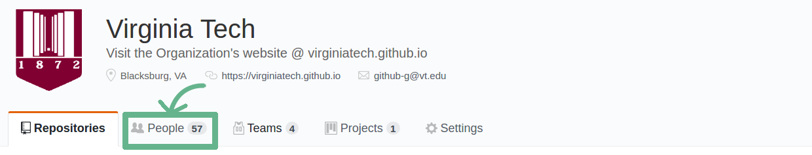
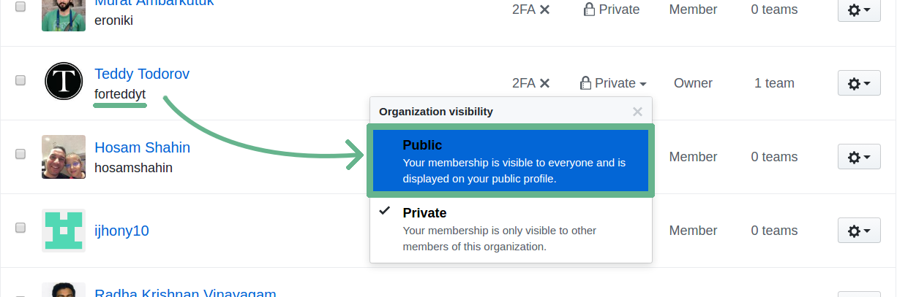

# **Email Verified!**
{:style="text-align: center;"}  
---

## An invitation has been sent to your GitHub account.
{:style="text-align: center;"}

### After accepting the invitation, make sure to set yourself as a ***PUBLIC*** member of the VT Organization!  
{:style="text-align: center;"}  

**1)** After accepting your invitation, navigate to the **People** tab:

  
	  

**2)** Scroll to your account, click on the *Organization Visiblity* drop-down menu, and set your visibility to **Public**:  

  
	

### If you are not a public member, you ***will not*** be able to request to add repositories!  
{:style="text-align: center;"}  

	<button class="btn-visible" style="font-size: 2rem;" onclick="openClick('https://github.com/orgs/VirginiaTech/invitation', true)">Click Here to Join</button>

